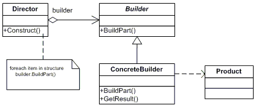

# Builder (Creational)

- Construye un objeto complejo por pasos. Los cuales se repiten al momento de crear nuevas instancias
del mismo objeto.

- Separa la construcción de un objeto complejo para que el mismo proceso de construcción sirva
para crear diferentes representaciones.

## Problema

Una aplicación necesita crear elementos que en conjunto resultan en algo complejo.
La especificación del resultado se encuentra en un lugar distinto y la representación necesita ser
construída en otro lugar.

+

## Actores

- Director
- Builder
- Concrete Builder
- Product

Referencias

https://en.wikipedia.org/wiki/Builder_pattern
https://www.tutorialspoint.com/design_pattern/builder_pattern.htm
https://sourcemaking.com/design_patterns