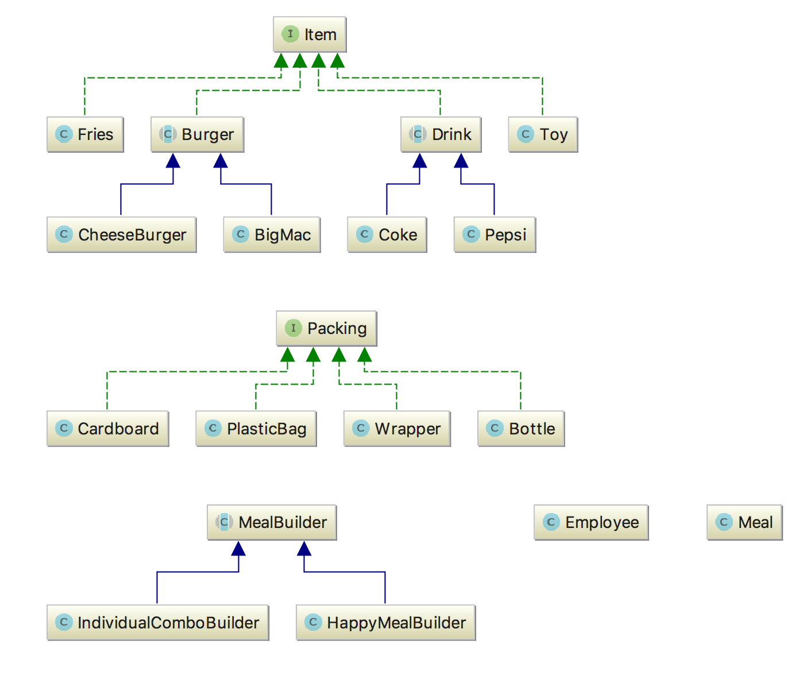

# Builder (Creational)

- It builds a complex object by steps. These steps will be repeated when new instances of the same 
object are created.

- It divides construction of a complex object so it can be possible to create different representations 
using the same process

## Problem

An application needs to create the elements of a complex aggregate. The specification for the aggregate 
exists on secondary storage and one of many representations needs to be built in primary storage.
 

## Actors

- Director
- Builder
- Concrete Builder
- Product

## Example

## References

https://en.wikipedia.org/wiki/Builder_pattern
https://www.tutorialspoint.com/design_pattern/builder_pattern.htm
https://sourcemaking.com/design_patterns