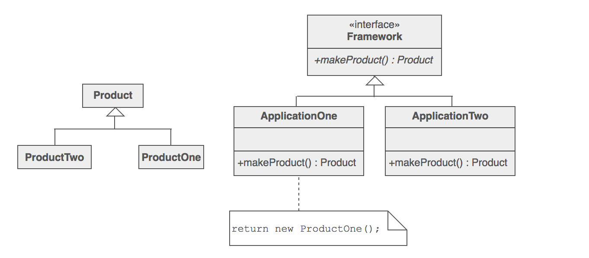
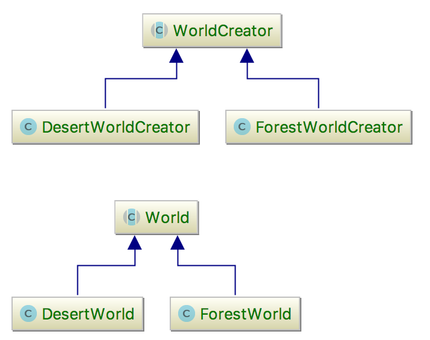

# Factory method (Creational)
>Define an interface to create instances but let subclasses to decide which class to instantiate 

## Problem
A framework needs to standardize the architectural model for a range of applications, but allow for 
individual applications to define their own domain objects and provide for their instantiation.

## Solution
1. The standardized part will be encapsulated in a "Creator" class depending on interfaces rather than
  instances
2. The instances will be retrieved via abstract methods defined in the "Creator" class
3. The client will need to create concrete classes implementing the interfaces used by the
 Creator and a sub-class of "Creator" to retrieve those instances.

## General structure

## Actors
* Abstract Creator
* Abstract Product
* Concrete creator
* Concrete products

## Relation with other patterns
* Factory method is to creating instances as template method is to implementing algorithms

 

## Example

## References

https://sourcemaking.com/design_patterns/factory_method

https://github.com/wdonet/designPatternsOOP/tree/master/FactoryMethod

https://en.wikipedia.org/wiki/Factory_method_pattern

