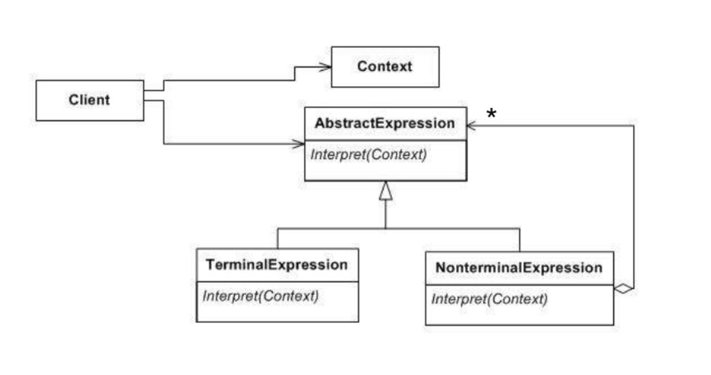
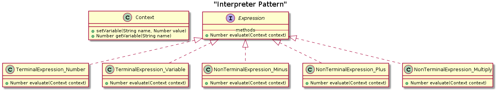

# Interpreter (Behavioral)
>Implementar un lenguaje especializado dentro de un programa

## Problema
Interpretar un lenguaje 

## Solución
Modelar el lenguaje en un arbol donde cada regla puede ser un 'composite' (una regla que referencia a otras reglas)
o un punto terminal.

## Estructura general

## Actores

- Abstract expression 
    - Declara la interfaz para ejecutar la operación
- Terminal expression. 
    - Implementa una operación asociada con un nodo terminal en la gramática
- Non-terminal expression.
    - Interpreta nodos no terminales, encadenando la llamada a otras reglas a las que hace referencia
- Context
    - Contiene información global que forma el estado del intérprete
- Client
    - Modela la gramática a través del arbol formado con "Expressions" e invoca la operación "interpretar"
      
## Consideraciones

- Este patrón no es un parser. Específicamente no se enfoca en parsear la entrada 

## Pros

- Fácil de cambiar y extender la gramática
- Es complejo para gramáticas grandes

##Ejemplo

## Referencias

https://es.slideshare.net/amanicka/interpreter-pattern-final1

https://sourcemaking.com/design_patterns/interpreter

https://es.wikipedia.org/wiki/Interpreter_(patr%C3%B3n_de_dise%C3%B1o)

