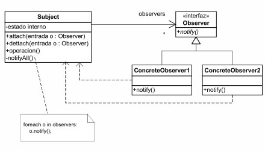

# Observer (Behavioral)
>Define a way to notify events to many classes

## Problem
Exists a relation between one component that triggers events and n objects that could be insterested
in being informed about those events.

## Solution
1. To create an interface Observer which will be implemented by the classes interested in being informed
 about triggered events by the observable classes. The class will contain a unique method 
 <code>update</code> that will be called by the observable classes. 
2. To create an abstract class that will be extended by the observable classes. This abstract class will contain:
   * A list of registered observers 
   * Method to register new observers
   * Method to delete existent observers
   * Method that iterating through the list of registered observers, will notify them one by one 
   by calling the method inherited from the Observer interface

## General structure

## Actors
* Observer
* Observable
      
## Some known uses
 - Swing
 - QT
 - Angular

## References

https://sourcemaking.com/design_patterns/observer

https://github.com/wdonet/designPatternsOOP/tree/master/Observer

