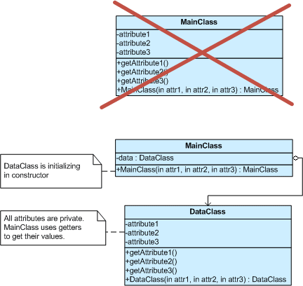
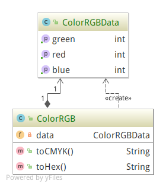

# Private class data (Structural)
> This pattern seeks to reduce exposure of atributes by limiting their visibility. 

## Problem
A class may expose its attributes (class variables) to manipulation when manipulation is no longer desirable, e.g. after construction. Using the private class data design pattern prevents that undesirable manipulation.

A class may have one-time mutable attributes that cannot be declared final. Using this design pattern allows one-time setting of those class attributes.

The motivation for this design pattern comes from the design goal of protecting class state by minimizing the visibility of its attributes (data).

## Intent
* Control write access to class attributes.
* Separate data from methods that use it.
* Encapsulate class data initialization.
* Providing new type of final - final after constructor.

## General structure

## Example structure 

## Actor
- Class 
    - ColorRGB
- DataClass
    - ColorRGBData
    
## References
