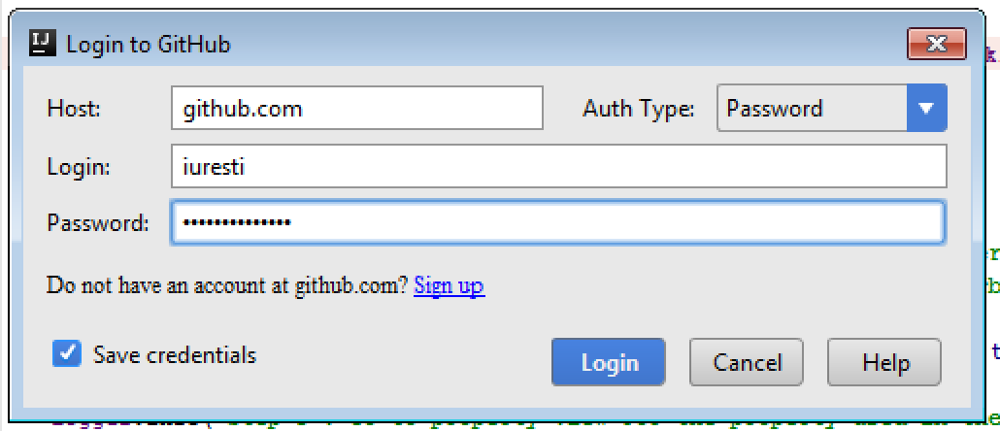
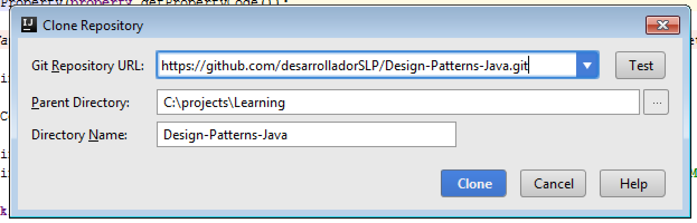
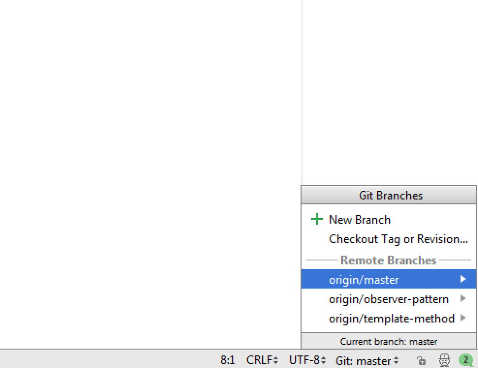

# Design patterns

## Project Set up

### Using IntelliJ
1. Import project from GitHub

   1. Using menu File/New/Project from version control/GitHub
   2. Select in Auth Type: Password
   3. Type credentials
   4. Check “Save credentials”
   5. Click on Login
   
 
 
 
 2. Set repository URL
   
    1. Copy https://github.com/desarrolladorSLP/Design-Patterns-Java.git to "Git Repository URL"
    2. Select an empty local directory to download the project
    3. Click on "Clone"
 
 
 
 
 3. After the project opens the current branch will be master. Switch to your desired branch
 
    1. In the bottom-right corner of IntelliJ click on "Git: master"
    
    2. Click on your desired branch name
    3. Click on "Checkout as new local branch"
    4. If checkout is successful, you'll see the name of the new branch at the bottom-right corner
    
 4. Simple test for permissions
    1. Add a simple modification 
    2. Right-Click on project name in project view    
    3. Click on "Git/Commit directory"
    4. Add a message in "Commit message" textbox
    5. From "Commit" button click on "Commit and Push" and accept the following dialogs
    6. You should see a green message "Push successful: Pushed 1 commit to ..."
    
 
 
 
 

 