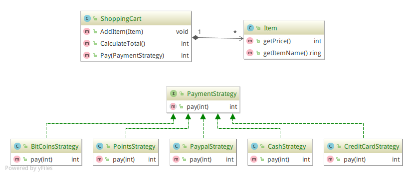
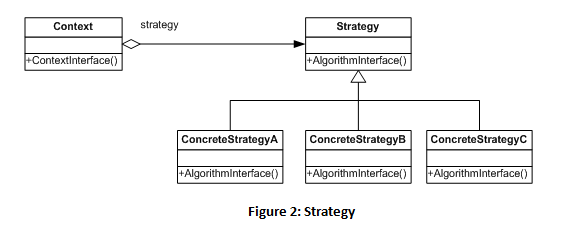

# Strategy (Behavioral).
>El patrón Strategy se utiliza para encapsular el funcionamiento de una familia de algoritmos, de forma que se pueda intercambiar su uso sin necesidad de modificar a los
 clientes.

## Problema.
En muchas ocasiones, se suele proporcionar diferentes algoritmos para realizar una misma tarea.
En este ejemplo tenemos un cliente que realiza una compra el cliente tiene la facilidad de seleccionar el 
metodo de pago para realizar su compra. 
Utilizando diferentes tipos algoritmos el cliente puede realizar su comprar utilizando los diferentes metodo de pago.

Lo deseable sería poder tener diferentes metodos de pago, desde el punto de vista
del cliente, no fueran tipos distintos de pagos. Simplemente se comportan diferente
porque usan distintos algoritmos internamente, pero todos ellos son formas de pago.

## Solución.
Mediante el uso de la herencia, el patrón Strategy permite encapsular diferentes algoritmos para que los clientes puedan utilizarlos de forma transparente.

## Estructura generica.

## Actores.
- Contexto
    - ShoppingCart
    - Item
- Strategy
    - PaymentStrategy
- ConcreteStrategy
    - BitCoinsStrategy
    - PointsStrategy
    - PaypalStrategy
    - CashStrategy
    -CreditCardStrategy

## Consideraciones.
El patrón Strategy es una buena alternativa a realizar subclases en
las entidades que deben comportarse de forma diferente en función del
algoritmo utilizado. Al extraer la heurística a una familia de algoritmos
externos, obtenemos los siguientes beneficios:
- Aumenta la reutilización de dichos algoritmos.
- Se evitan sentencias condicionales para elegir el comportamiento deseado.
- Los clientes pueden elegir diferentes implementaciones para un mismo comportamiento deseado, por lo que es útil para depuración y pruebas donde se pueden escoger implementaciones más simples y rápidas.

## Referencias.
https://sourcemaking.com/design_patterns/strategy
http://www.journaldev.com/1754/strategy-design-pattern-in-java-example-tutorial

