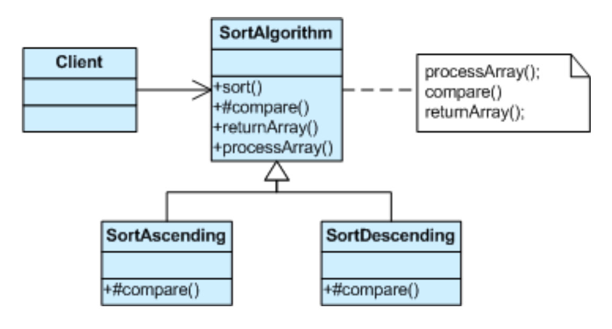
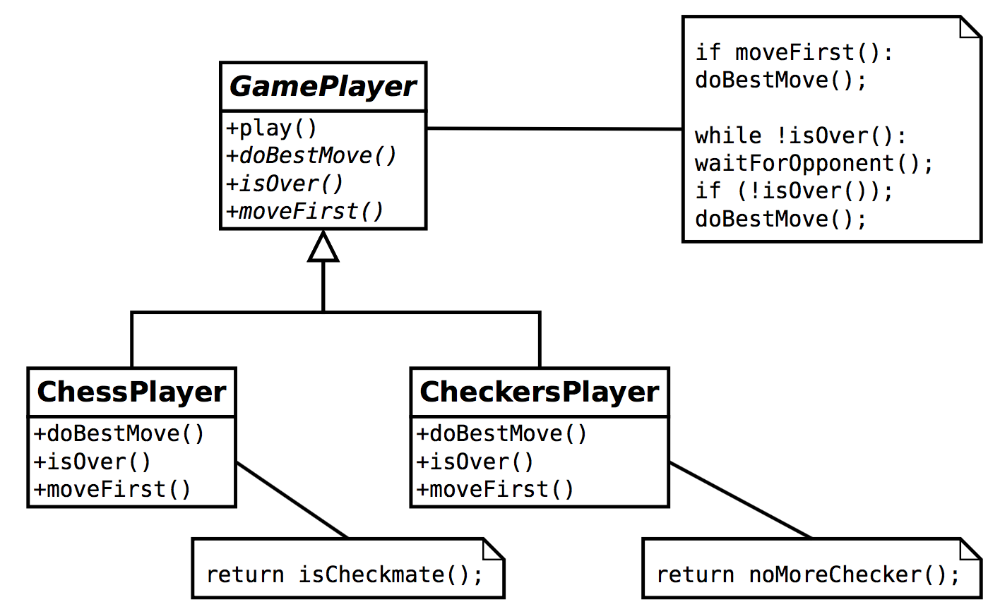
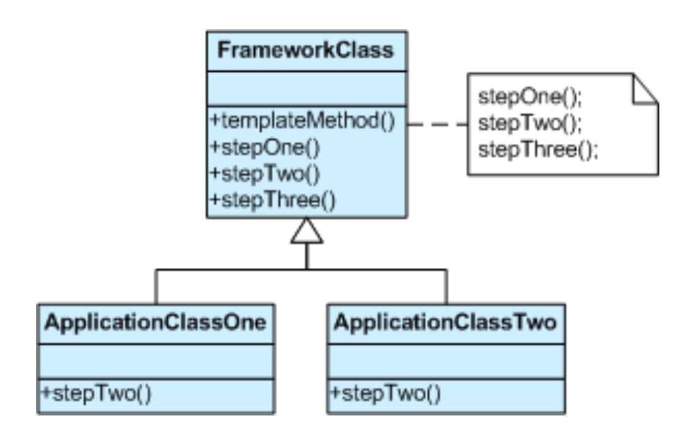
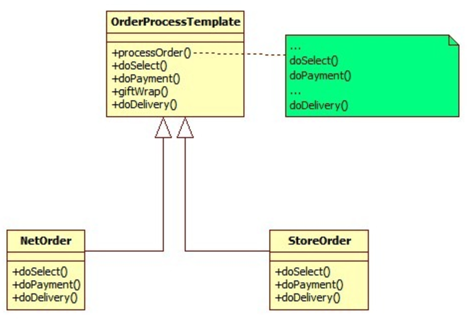

# Template Method

## Problem
Two different components have significant similarities,
but demonstrate no reuse of common interface or implementation.
If a change common to both components becomes necessary,
duplicate effort must be expended.

## Examples

1. Sort algorithm

2. Game player

## Solution
Define the skeleton of an algorithm in an operation,
deferring some steps to client subclasses.
Template Method lets subclasses redefine certain steps of an algorithm
without changing the algorithm's structure.
Base class declares algorithm 'placeholders',
and derived classes implement the placeholders.

## Implementation

## When to use the Template Design Pattern

The Template Method pattern should be used in the following cases:
- To implement the invariant parts of an algorithm once and leave it up to subclasses to implement the behavior that can vary.

- When common behavior among subclasses should be factored and localized in a common class to avoid code duplication. You first identify the differences in the existing code and then separate the differences into new operations. Finally, you replace the differing code with a template method that calls one of these new operations.

- To control subclasses extensions. You can define a template method that calls "hook" operations (see Consequences) at specific points, thereby permitting extensions only at those points.

## Rules of thumb
- The template method in base class should be restricted so
that the subclasses does not override it.

- It is better to have lesser number of methods to be implemented
by the subclasses and that will help provide an easy implementation.

- Use better naming convention to highlight the methods that should
be implemented by the subclasses.

- Template method design pattern uses the inverted control structure as
in “Don’t call, we will call you”.
The operations defined in subclasses are called by base class from
within the template method.

- Strategy is like Template Method except in its granularity.

- Template Method uses inheritance to vary part of an algorithm.

- Strategy uses delegation to vary the entire algorithm.

- Strategy modifies the logic of individual objects. Template Method modifies the logic of an entire class.

- Factory Method is a specialization of Template Method.

